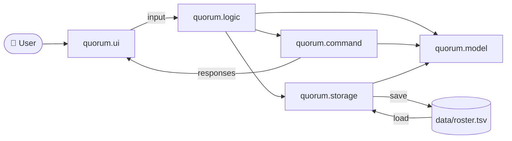
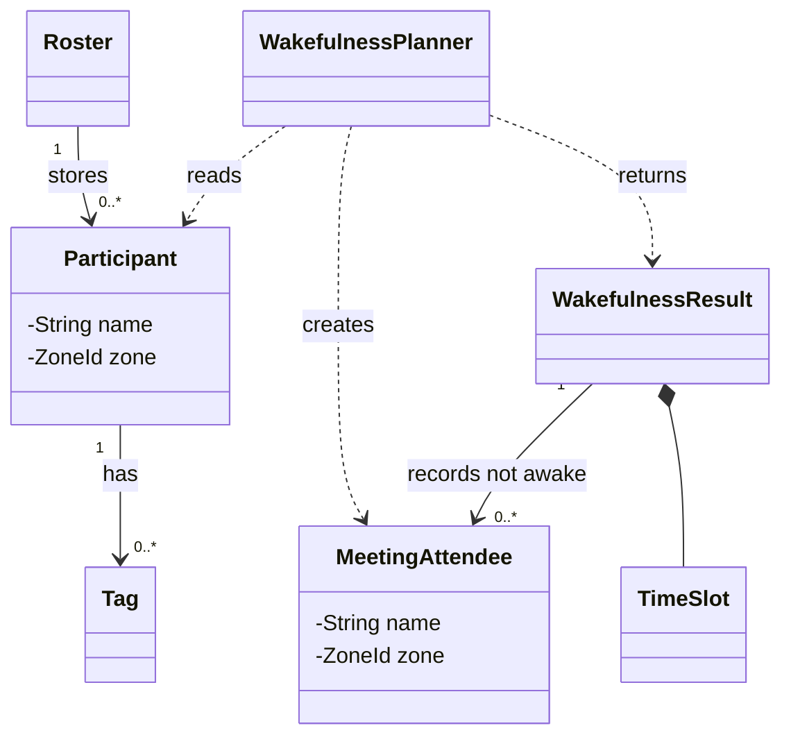
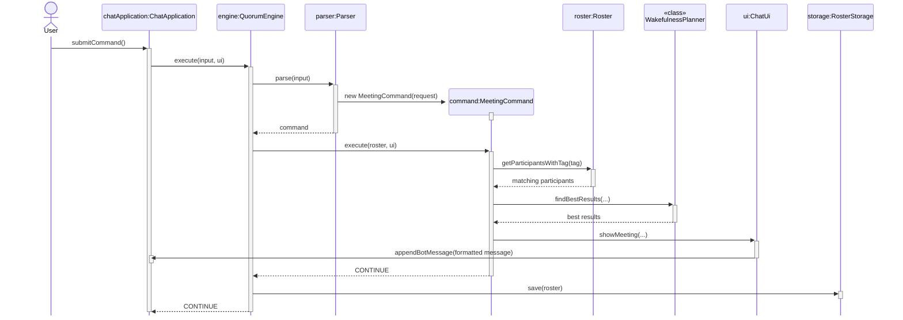

# Quorum Developer Guide

This guide describes Quorum's design and the software engineering process used to develop it. For commands and user-facing behaviour, see the [User Guide](UserGuide.md).

## Table of Contents

- [Setting Up](#setting-up)
- [Design](#design)
- [Implementation](#implementation)
- [Testing](#testing)
- [Software Engineering Process](#software-engineering-process)
- [Acknowledgements](#acknowledgements)
- [Appendix: Proposed Enhancements](#appendix-proposed-enhancements)

## Setting Up

### Prerequisites

- JDK 25
- Git

Clone the repository and import `build.gradle` as a Gradle project in your IDE.

On macOS or Linux, use these commands from the repository root:

```text
./gradlew run                 # Run the graphical interface
./gradlew run --args="--cli"  # Run the console interface
./gradlew check               # Run tests and Checkstyle
./gradlew shadowJar           # Build build/libs/quorum.jar
```

On Windows, replace `./gradlew` with `.\gradlew.bat`.

## Design

### Architecture

Quorum uses responsibility-based packages. Arrows below show the main control and data flow.



| Package | Responsibility |
| --- | --- |
| `quorum.ui` | Receives input and displays text responses through the graphical or console interface. |
| `quorum.logic` | Parses input and coordinates command execution and storage. |
| `quorum.command` | Represents and executes each supported command. |
| `quorum.model` | Stores roster data and ranks meeting times. |
| `quorum.storage` | Loads, encodes, and saves the roster. |

`Launcher` is the application's entrypoint. It starts the graphical interface by default or the console interface when `--cli` is present. The graphical interface is implemented with JavaFX. Both interfaces share command processing, model, storage, and response formatting; only their input and display handling differ.

### Main Design Decisions

- `ChatUi` is the response view for the graphical interface, while `ConsoleUi` is the response view for the console interface.
- `Parser` handles command syntax, while each `Command` implementation handles execution.
- Commands depend on `ResponseView` rather than `ChatUi` or `ConsoleUi`, so they are not coupled to a specific frontend.
- Currently, `ChatUi` and `ConsoleUi` inherit `TextResponseView` and share the same text response formatting.
- `RosterStorage` keeps application logic from being coupled to a specific storage mechanism, while `RosterCodec` keeps file access from being coupled to a specific roster format.
- `QuorumException` carries user-correctable errors from parsing, command execution, and storage to the frontend.

### Meeting Model



Each `Participant` stores its own collection of `Tag` values; there is no shared `Tag` entity or explicit many-to-many association. The same normalized tag value can nevertheless appear on several participants, so tags serve a conceptual many-to-many grouping role.

During a meeting search, the person running Quorum is included as `You`, using the timezone supplied in the `meeting` command. `MeetingAttendee` gives `You` and the selected roster participants the same name-and-timezone representation without adding `You` to the roster.

## Implementation

### Command Execution

The following sequence shows a successful `meeting` command from the graphical interface. All commands use the same parse-execute-save path. During execution, commands send responses through `ResponseView`, except `ByeCommand`, which returns `EXIT` for the frontend to handle.



Parsing, command execution, and storage can throw `QuorumException`. The active frontend displays its message and remains available for another command.

### Meeting-Time Ranking

`WakefulnessPlanner` ranks candidate slots as follows:

1. Add `You` and every participant with the requested tag to the attendee list.
2. Generate starts at 30-minute intervals across the requested date in the timezone supplied in the command.
3. Count an attendee as awake only when the full meeting is within 08:00 to 22:00 in that attendee's timezone.
4. Keep every slot with the greatest awake count, in chronological order.

Each candidate slot uses `Instant` so that it represents the same moment worldwide. Quorum then uses each attendee's `ZoneId` to determine their local time before checking whether they are awake. `TextResponseView` displays at most five maximum-scoring slots and reports how many are not shown.

### Roster Persistence

`QuorumEngine` loads `data/roster.tsv`, relative to the working directory, when it starts. It saves the roster after every successfully executed command. A missing file produces an empty roster. `TsvRosterCodec` stores one participant per line using these fields:

```text
name<TAB>zoneId<TAB>comma-separated tags
```

The codec validates stored participants, timezones, and tags while loading. Invalid data is reported as a startup error instead of being silently discarded.

### Ending a Session

`ByeCommand` returns `EXIT` instead of using an exception for normal control flow. The console leaves its command loop and displays the goodbye message. The graphical interface displays the message, disables input, and closes after a three-second `PauseTransition`.

## Testing

JUnit tests are organised to mirror the corresponding production packages.

| Area | Main behaviours tested |
| --- | --- |
| Model | Model validation, immutable participant updates, direct roster operations, and meeting-time ranking. |
| Commands | Command effects, `ResponseView` calls, errors, and `CommandOutcome` values. |
| Parser | Command routing, argument parsing, and validation. |
| Storage | TSV round trips, malformed data, missing files, and file-system errors using temporary directories. |

Command tests use `SilentUi` to suppress console output and small focused spies to record the relevant `ResponseView` call. This keeps the tests independent of displayed text and unrelated UI methods.

Run `./gradlew check` before committing. It runs the tests and Checkstyle checks. GitHub Actions runs the same task on Windows, macOS, and Linux whenever commits are pushed and when pull requests are opened or updated.

Currently, the graphical interface has no automated UI tests. Command behaviour remains covered through the shared parser, commands, model, and `ResponseView` boundary.

## Software Engineering Process

### Iterative Development

Quorum was developed in small increments. Abstractions were added in response to concrete design problems, avoiding premature abstraction.

| Milestone | Main changes |
| --- | --- |
| Foundation | Added Gradle, the console command loop, roster, `add`, and `list`. |
| Automated checks | Added Checkstyle and continuous integration. |
| Roster management | Added `delete`, `edit`, and the command class hierarchy. |
| Persistence | Added local TSV roster storage, startup loading, saving after each command, and storage/codec boundaries. |
| Meeting search | Designed and added timezone search, tags, and wakefulness-based meeting ranking. |
| Broader testing | Added focused model, command, parser, and storage tests; fixed defects exposed by testing. |
| Graphical interface | Extracted shared engine and response abstractions and added the graphical interface. |
| Documentation | Created and refined the User Guide and Developer Guide. |

### AI-Assisted Development

LLMs assisted with design discussions, implementation, tests, refactoring, and documentation. Their suggestions were reviewed against the requirements and repository conventions, then checked through source inspection, tests, Checkstyle, or manual execution as appropriate.

The numbered [`logs`](../logs/) summarise the requests, responses, mistakes, and revisions. A branch-based [unit-test prompt experiment](../logs/016-designing-prompt-quality-unit-test-experiment.md) also compared basic and structured prompts; its [results](../logs/018-evaluating-unit-test-prompt-results-across-sol-and-luna.md) informed the later testing approach.

### Documentation and Traceability

Feature and refactoring commits were kept separate where practical. Significant AI-assisted interactions were summarised in numbered logs and checked before being committed. User-facing documentation was verified against the parser, model, storage behaviour, and packaged application.

## Acknowledgements

- The CS2103/T iP materials, and [SE-EDU guides](https://se-education.org/guides/) informed the incremental project structure. Gradle, JavaFX, and GitHub Actions configuration was copied or adapted from the CS2103/T iP template.
- The Checkstyle configuration was copied from [SE-EDU AddressBook-Level3](https://github.com/se-edu/addressbook-level3/tree/master/config/checkstyle) and largely follows the [SE-EDU Java coding standard](https://se-education.org/guides/conventions/java/intermediate.html).
- OpenAI LLMs assisted throughout development. [OpenAI Codex](https://openai.com/codex/), including GPT-5.6 Sol and GPT-5.6 Luna, was used for the unit-test prompt experiment and later development. LLM output was reviewed by the developer; details are recorded in [`logs`](../logs/).

## Appendix: Proposed Enhancements

These are possible future changes, not current features.

| Current limitation | Proposed enhancement |
| --- | --- |
| Every attendee uses the same 08:00 to 22:00 awake hours. | Store configurable awake hours for each participant. |
| Meeting times are ranked only by the number awake. | Add optional ranking methods such as minimising inconvenience. |
| Roster saves overwrite the existing file directly. | Write to a temporary file and replace the roster atomically. |
